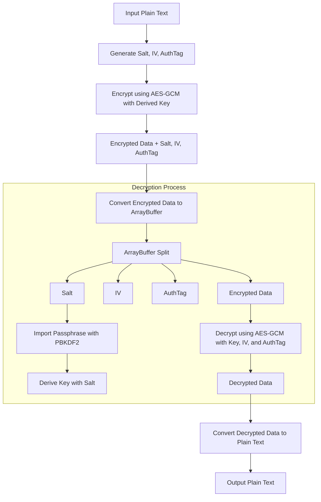

# docsify-ciphertext

This Docsify plugin allows you to encrypt and decrypt sections of your markdown content using a passphrase. Users can click a key icon to input a passphrase and decrypt all encrypted fields on the page. The encrypted content is protected using AES-256-GCM encryption, ensuring that only users with the correct passphrase can view the decrypted content.
the passphase is

## Exemple


```passphrase
myPassphrase
```


```ciphertext
KLLKb4dGZep+Clqf5OsUqPo1LDy48g+Jn8idWEmre4ThlQwgjdYnHufB4FIDXyZ70Dsnbp5VbhuHbto4ZfR1
```


## Encoder / Decoder 

[ciphertext](./cipher.html ':include :type=iframe width=100% height=800px')

* [ciphertext encrypt/decrypt ](/cipher.html)


## Features

- **Encrypt and Decrypt Content:** Use this plugin to display encrypted content in your Docsify site. Content is hidden until the correct passphrase is entered.
- **Lock/Unlock Toggle:** Once decrypted, users can toggle between the encrypted and decrypted content by clicking the lock/unlock icon.
- **Persistent Passphrase:** The passphrase is stored in `localStorage`, so users don't need to re-enter it every time they navigate between pages.
- **Multiple Fields:** Decrypt multiple fields on the same page with a single passphrase. If a field fails to decrypt, users can re-enter the correct key for that field.
- **Customizable Icons:** The plugin uses intuitive key 🔑 and lock 🔒/unlock 🔓 icons for user interaction.

## Algorithm



## Installation

1. **Include the Plugin Script:**

   First, add the plugin JavaScript file to your Docsify site. Either download the script or link it directly in your `index.html` file.

   ```html
   <script src="decrypt-plugin.js"></script>
   ```

2. **Initialize the Plugin:**

   After including the script, add the following configuration in your Docsify settings (usually in the `index.html`):

   ```html
   <script>
     window.$docsify = {
       name: 'Docsify Ciphertext Decryption Plugin',
       plugins: [
         window.decryptContentPlugin,
         // Other plugins...
       ]
     };
   </script>
   ```

3. **Encrypt Your Content:**

   To encrypt content, you can use a Node.js script that generates AES-256-GCM encrypted ciphertext from plaintext data (see [Usage](#usage) below). Insert the encrypted content into your markdown like this:

   ```markdown
   ```ciphertext
   KLLKb4dGZep+Clqf5OsUqPo1LDy48g+Jn8idWEmre4ThlQwgjdYnHufB4FIDXyZ70Dsnbp5VbhuHbto4ZfR1
   ```
   ```

## Usage

1. **Encrypting Content (Node.js):**

   You can encrypt content using the following Node.js script to produce AES-256-GCM ciphertext:

   ```javascript
   const crypto = require('crypto');

   function encrypt(data, passphrase) {
     const salt = crypto.randomBytes(16);
     const key = crypto.pbkdf2Sync(passphrase, salt, 100000, 32, 'sha256');
     const iv = crypto.randomBytes(12);
     const cipher = crypto.createCipheriv('aes-256-gcm', key, iv);
     const encrypted = Buffer.concat([cipher.update(data, 'utf8'), cipher.final()]);
     const authTag = cipher.getAuthTag();
     return Buffer.concat([salt, iv, authTag, encrypted]).toString('base64');
   }

   const passphrase = 'myPassphrase';
   const data = 'https://example.com';

   console.log(encrypt(data, passphrase));
   ```

   Use this script to encrypt your content and include the ciphertext in your markdown files.

2. **Decryption Flow:**

   - **🔑 Key Icon:** Clicking this icon prompts the user to input the passphrase. The key is stored in `localStorage` and used to decrypt any encrypted fields on the page.
   - **🔒 Lock Icon:** Clicking this icon decrypts the content if the correct key has been entered. It then changes to an unlock icon.
   - **🔓 Unlock Icon:** Clicking this icon reverts the content back to its encrypted state.

3. **Toggling Content:**

   Users can toggle between the encrypted and decrypted versions of the content by interacting with the lock and unlock icons. All encrypted content is protected by AES-256-GCM encryption.

## API

The plugin adds two user interaction icons:

- **🔑 Key Icon:** Prompts the user to enter a passphrase. The passphrase is stored in `localStorage` for convenience.
- **🔒/🔓 Lock/Unlock Icon:** Used to toggle between the encrypted and decrypted content.

## Example

Here’s an example of how encrypted content would look in your markdown:

```markdown
# My Secret Links

Here are my secret links. Decrypt them using the 🔑 key icon. Remove the backslash "\" to make it work

\```ciphertext
KLLKb4dGZep+Clqf5OsUqPo1LDy48g+Jn8idWEmre4ThlQwgjdYnHufB4FIDXyZ70Dsnbp5VbhuHbto4ZfR1
\```

```

After entering the passphrase, users will be able to see the decrypted content, which may look like a URL, text, or any other data you encrypted.

## Security

- **AES-256-GCM Encryption:** The plugin uses strong AES-256-GCM encryption, which provides confidentiality and integrity verification through authentication tags. Only users with the correct passphrase can decrypt the content.
- **Passphrase Management:** The passphrase is stored in `localStorage`, so the user doesn't need to re-enter it as they navigate between pages. You can clear the passphrase using the `clearPassphrase` function if needed.


### Current Good Practices:
1. **AES-GCM Mode**: AES-GCM (Galois/Counter Mode) is a secure and modern encryption method that provides both confidentiality and integrity by including an authentication tag (AuthTag). This is excellent for preventing tampering and ensuring the data hasn't been modified.

2. **PBKDF2 for Key Derivation**: Using PBKDF2 (Password-Based Key Derivation Function 2) to derive the encryption key from the passphrase with a salt is a good practice. PBKDF2 adds computational work to slow down brute-force attacks on passwords.

3. **Salt for Key Derivation**: Including a salt ensures that even if two people use the same password, the derived keys will be different. This prevents precomputed attacks like rainbow table attacks.

### Security Recommendations:

The encryption and decryption algorithm uses standard cryptographic practices, but there are several improvements and best practices to ensure it remains secure.

This paragraph highlight security improvement to be done to this plugin that could happen in the futur.

#### 1. **Use a Stronger Key Derivation Function**:
   - **Issue**: PBKDF2, while still widely used, is not the most resilient to GPU-based attacks due to its relatively fast performance.
   - **Recommendation**: Consider using a more modern key derivation function like **Argon2** or **scrypt**, which are designed to be memory-hard and resistant to hardware-accelerated brute-force attacks. These functions make it much harder to crack passwords via brute force due to their computational and memory requirements.
   
   **Why?**: Both Argon2 and scrypt are slow to compute and can require large amounts of memory, making it more resistant to parallel attacks from specialized hardware like GPUs or FPGAs.

#### 2. **Use a Sufficient Number of Iterations for PBKDF2**:
   - **Issue**: While you are using 100,000 iterations, which is reasonable for PBKDF2, increasing this number over time is recommended as hardware improves.
   - **Recommendation**: For PBKDF2, aim for at least **310,000 iterations** (as recommended by NIST) to ensure the password derivation process is sufficiently slow.
   
   **Why?**: PBKDF2 is designed to slow down brute-force attacks. By increasing the number of iterations, you make it computationally expensive for attackers to try different passwords.

#### 3. **Ensure a Secure Passphrase**:
   - **Issue**: If a user selects a weak passphrase, even strong encryption and key derivation functions won't prevent an attacker from guessing it.
   - **Recommendation**: Enforce strong passphrase policies (e.g., minimum length, use of upper/lower case letters, numbers, and special characters). Additionally, consider using a **password manager** to generate and store strong random passphrases.
   
   **Why?**: A weak passphrase is vulnerable to brute-force or dictionary attacks, which can render even the best encryption ineffective.

#### 4. **Use a Strong Random Number Generator for Salt and IV**:
   - **Issue**: The security of your key derivation and encryption relies on the randomness of the salt and initialization vector (IV). If a weak random number generator is used, attackers may predict or manipulate these values.
   - **Recommendation**: Use a **cryptographically secure random number generator** (CSPRNG) like `window.crypto.getRandomValues()` for generating both the salt and IV.
   
   **Why?**: A strong, unpredictable salt and IV ensure that the encryption process remains secure even if some parts of the system are compromised.

#### 5. **Ensure Proper IV Length**:
   - **Issue**: The AES-GCM mode requires a 12-byte (96-bit) IV for optimal security and performance. Using an IV length different from 12 bytes may reduce the effectiveness of GCM mode.
   - **Recommendation**: Ensure the IV is exactly 12 bytes (96 bits).
   
   **Why?**: AES-GCM works best with a 96-bit IV. Longer IVs will need to be hashed, potentially weakening security. Shorter IVs will reduce the number of messages that can be safely encrypted with the same key.

#### 6. **Handle Authentication Failures Gracefully**:
   - **Issue**: When decryption fails (e.g., due to tampering or incorrect passwords), make sure the system does not leak information about why it failed.
   - **Recommendation**: Use **generic error messages** (like "Decryption failed") and avoid revealing whether the passphrase was incorrect or if the data was modified.
   
   **Why?**: Leaking information (like whether the passphrase or the ciphertext was wrong) can help attackers in guessing attacks or confirming when they have found the correct key.

#### 7. **Consider Ephemeral Keys**:
   - **Issue**: Reusing the same passphrase for multiple encryptions can increase the risk of certain cryptographic attacks.
   - **Recommendation**: Use **ephemeral keys** (derived from a new passphrase or a new salt each time) to encrypt each message. Alternatively, implement session-based encryption keys for systems that require multiple operations.
   
   **Why?**: Ephemeral keys ensure that even if one encryption is compromised, it doesn’t affect others.

#### 8. **Validate the AuthTag**:
   - **Issue**: AES-GCM’s security depends on verifying the integrity of the data using the AuthTag. If this step is skipped or improperly handled, data can be tampered with undetected.
   - **Recommendation**: Always ensure that the AuthTag is properly validated during decryption.
   
   **Why?**: AuthTag ensures that any modification to the ciphertext is detected, making it essential for protecting against tampering.

#### 9. **Avoid Storing Passphrases in `localStorage` for Long Periods**:
   - **Issue**: Storing sensitive data like a passphrase in `localStorage` can be risky, as it persists across sessions and can be accessed by malicious scripts or browser extensions.
   - **Recommendation**: Use **sessionStorage** instead of `localStorage` if the passphrase must be stored temporarily, or clear the passphrase as soon as it is no longer needed. Alternatively, prompt the user for the passphrase every time.
   
   **Why?**: `localStorage` is persistent and accessible by JavaScript, making it a target for XSS attacks.

### Summary of Recommendations:
- **Switch to Argon2 or scrypt** for stronger password protection.
- **Increase PBKDF2 iterations** if sticking with PBKDF2.
- **Enforce strong passphrases** to protect against brute-force attacks.
- **Use a secure random number generator** for generating salt and IV.
- **Ensure a 12-byte IV** for AES-GCM encryption.
- **Use generic error messages** to avoid leaking information.
- **Consider ephemeral keys** to enhance encryption security.
- **Validate AuthTags** to detect tampering.
- **Use session-based storage** for passphrases instead of `localStorage`.

By following these recommendations, you can significantly improve the security of your encryption and decryption process.


## Limitations

- **Client-Side Encryption:** The encryption and decryption happen entirely on the client side. Ensure that your use case aligns with this approach.
- **No Password Recovery:** If a user forgets the passphrase, there is no way to recover the encrypted content without knowing the correct key.


## Tests strings

### Lorem ipsum

```markdown
Lorem ipsum dolor sit amet, consectetur adipiscing elit. Vestibulum accumsan accumsan lectus vitae fermentum. Etiam dapibus ligula blandit, finibus neque et, feugiat nisi. Lorem ipsum dolor sit amet, consectetur adipiscing elit. Mauris condimentum massa sit amet neque aliquam, ac commodo lorem euismod. Praesent tristique pellentesque venenatis. Cras libero ex, feugiat quis neque at, dictum sagittis ex. Phasellus id aliquet felis. Aenean porta erat ac accumsan efficitur. Donec quis vehicula lorem, at efficitur nibh. 
```

```ciphertext
Gwb7NfJa2J8HLJ2UtVs7ft7xz0IzP1fBH1N27XCM4SJPzg1aGD/m8q9Cni+wkeUbJC3rqf5/s7i3QD6CrjVtlrY+mpK25Amx4Hw6a5J4djUlBf+ov6FB5QhFAdfPnj9WMD3MV25rO/9SLVIx7pf8IhDv6S2Vh+UWz6vgHx3z9b7yrwoi2hZZH4+cSVQv8JrBrcZV+MYl5xWGYA+mF575fNsxlcOR8BRwWzicHDDRIzWkP26v0MLgpKtwSqttn7v9Q/CWf8FEFcX2osV7keAozUrASqnoSwyKD7E3pyjlEQ5VEtKNr7PCRtlHDHCi0uAazwycrgtSJfzmtbKTmtHMXk+r8mKHoUkvK++soq2uJwfVajlOYhf1nHAIo5FsmQmlY7YFcg63oMbJCKA39/U5bcNJ+cZ0ztMEY3PWEs5obOYs4PrVPYQtylP/yNx+6bOmuG/V1W9idXsqByRBKZP7Rxa1ogrLcThU2yiS9R5TA5ubq1MpAK2+MV3tHieuRXsWltKsX3A4EOw8x52wWVNq3Bx6z7gnqNI74g4FYTnerbSI5UTLkcrynG0OTKKgzYSO54/f5S6HONChXVxwz0IJnfupw7pESYDVLDlklA2IiemjgKJCZNWihVOuS0g+HffbSRyDm60WJFjKjC8Xg2QMML12Nu48o7M1xl90nfvwTyi0mFNn9la3Ev3E+R0RM8tOfiDdOyfka4BrAbi5GBjlB1nnfYsG0uUt8xAxq4ILKvb5+ZpL
```

### ASCII

```markdown
Hello, this is an ASCII test.
Characters: A-Z, a-z, 0-9
Symbols: ! @ # $ % ^ & * ( ) _ + - = [ ] { } ; : ' " , . < > / ? | \ ~
```

```ciphertext
u4V96t9L6mugvpliWleLa40kNqw2l4HzLlnCBKrP+9tMnIe/I5IIa70MzVCZihvnXwkhCrA1UXLrkts63J3ZWK//qcRibzXK3i+dpgfD1RlDMb3StNHT2IDufQ0hjwi4oXUTCsrvZe5RMVWJ7HLRowgQzblCbeI85Rnyh2Isrsc5yhWb7Yt9v5CWHlC/amIaFIoB2DH8ll8j1JuA246EsCEKfYL11rYM5/U=
```

### UTF-8

```markdown
This is a UTF-8 test.
Accented characters: é, à, ö, ç, ñ, ü, ø, å
Greek letters: α, β, γ, δ, ε, ζ, η, θ, λ, μ, π, σ, τ, φ, ω
Currency symbols: €, ¥, £, ₹
Math symbols: ∑, ∞, √, ∫, ≠, ≤, ≥
```

```ciphertext
Gaua0/pwJBP8oJ2Csjd86AIVXHRc3Vn1Mn4rtcaepCJXe7HTZyGJnHEuQQuLEg/Othol4U7e+1OuQFHhZ17/WEfEJNiZRx5AJtV0pberkTN/lB8PLP/K/uo8MdJfShz3aUlMOSwZOr8GTTn3gTfNiLc7rJyiAILwMU/P7weztGFH1JBkphhae0bk8t9nJa3YIPtWlojI/jhn0iVcx5X9w5zATd1vZd4VxTUlzo6bTnwtq/g3QsD795AdWMQdNrAgQ0Tp0IZW/iWymoKn49ScLoQzbSvTjgwsHmyAgifML4Vw0vx6IdTR6D+Btsw/g/gxF1FYEonLQNUqDIKDRMCFxvZN7PShelFN6nWdb/Jl58tfTQ==
```

### Emoji


```markdown
This is an Emoji test.
Faces: 😀 😁 😂 🤣 😍
Animals: 🐶 🐱 🦊 🐻 🦁
Nature: 🌳 🌻 🌞 🌈 🌊
Objects: 🚗 ✈️ 🖥️ 📱 🎧

```

```ciphertext
nnzLYcp6LTlZEM5glRsUdb7bHzzB3e1hoA8EkDk/UMClPnX/0DgmBmY2u/A8TAHZTsE035/yxqCs8omXqyAJfMVTlc1IjiN92mGVJq9XRyeRPTU/vSi8zYr+Mf5iuE/e2vzDsYYqpsS2ayKy/7sE5Sw3k7XTp/pa7JNZGA9ATJpZqq+5sjko1q2tX20r7baccVFHxEt0Q4CHZ4XJLITbSdhXy28zCc4pqGhelx9J8X2QkdizNVoQ/e2WFSpY/L8i9FLKyOCMhM6wiKf8
```

### JSON


```markdown
{
  "name": "Alice",
  "age": 30,
  "email": "alice@example.com",
  "interests": ["coding", "encryption", "reading"]
}

```

```ciphertext
/hSKMVdgtBLN++f7gnMyDJlO6koBh2Gvt5n20NNdViEtE0cVwiwcEkiW3+kfYezP8W2i1oqQZFJ5g8bABlIpl0cKcC29DcVAE0iyFz7yAFVKTF3D21qIDZjUQLeiWz10dIptGcuRmI4yJmt9+f5O6xSEQbyj070uVSTiwg5KjV1FSyQvLRnA2iLX2LCz37DAU+DGqfSQG+SBow0PC4BkK2aZ

```

