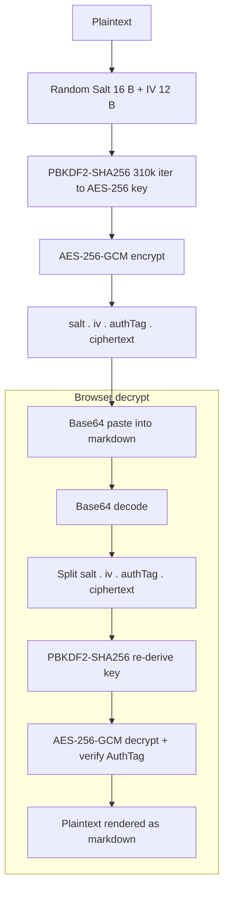

# docsify-ciphertext

A [Docsify](https://docsify.js.org) plugin that lets you embed AES-256-GCM encrypted blocks in your markdown. Readers click **🔑 Decrypt** and enter a passphrase — everything happens locally in the browser, zero server involved.

## Quick start

### 1. Add the script to your `index.html`

Place it **after** your `window.$docsify` config block and **before** `docsify.min.js`:

```html
<!-- your $docsify config -->
<script>
  window.$docsify = { name: 'My Docs', /* ... */ };
</script>

<!-- single-line import — auto-registers, no plugins array needed -->
<script src="https://gllmar.github.io/docsify-ciphertext/docsify-ciphertext.js"></script>

<!-- docsify core -->
<script src="https://cdn.jsdelivr.net/npm/docsify@4/lib/docsify.min.js"></script>
```

That is the entire installation. No `plugins: [...]` entry required.

### 2. Encrypt your content

Open [cipher.html](./cipher.html) (or use the iframe below) to encrypt text with a passphrase.

[ciphertext](./cipher.html ':include :type=iframe width=100% height=800px')

* [Open full-page encryptor](./cipher.html)

Or use the Node.js CLI:

```bash
node crypto-cli.js -e -i "My secret text" -p "myPassphrase" -c
```

### 3. Embed the ciphertext in your markdown

The following is a **live working example**. Passphrase: `myPassphrase`.

It decrypts to:
> Hello from docsify-ciphertext! This text was encrypted with AES-256-GCM + PBKDF2-SHA256 (310 000 iterations).

Markdown source:

````markdown
```ciphertext
IphI5BWbzwgIl2rlqPCzkuDQWecWvsFgZWKFNHztLaY7QXEazEelRCGVXa3YD3Fh1Nlwwbe6kBXLXYbzqa0NSCgw1VQ0EVkzmM5vzuJf9eEtxuqVkyL9/0CE3v+KM8p5RW2HShnebsjaYyvMybxJ08xFIwpvEtRH47PKMKEunKxKYiQEm3CC6iQwuRqo7uoenHpjeHz+19gxx2r9FeA=
```
````

Live block (click **🔑 Decrypt**, enter `myPassphrase`):

```ciphertext
IphI5BWbzwgIl2rlqPCzkuDQWecWvsFgZWKFNHztLaY7QXEazEelRCGVXa3YD3Fh1Nlwwbe6kBXLXYbzqa0NSCgw1VQ0EVkzmM5vzuJf9eEtxuqVkyL9/0CE3v+KM8p5RW2HShnebsjaYyvMybxJ08xFIwpvEtRH47PKMKEunKxKYiQEm3CC6iQwuRqo7uoenHpjeHz+19gxx2r9FeA=
```

---

## How it works


```mermaid
graph TD
    A[Plaintext] --> B[Random Salt 16 B + IV 12 B]
    B --> C[PBKDF2-SHA256 310k iter to AES-256 key]
    C --> D[AES-256-GCM encrypt]
    D --> E[salt . iv . authTag . ciphertext]
    E --> F[Base64 paste into markdown]

    subgraph Browser decrypt
        F --> G[Base64 decode]
        G --> H[Split salt . iv . authTag . ciphertext]
        H --> I[PBKDF2-SHA256 re-derive key]
        I --> J[AES-256-GCM decrypt + verify AuthTag]
        J --> K[Plaintext rendered as markdown]
    end
```

### Binary format

| Offset | Length | Field |
|--------|--------|-------|
| 0 | 16 B | Random salt (PBKDF2 input) |
| 16 | 12 B | IV (AES-GCM nonce) |
| 28 | 16 B | GCM authentication tag |
| 44 | N B | Ciphertext |

All fields concatenated and Base64-encoded.

---

## Features

| Feature | Detail |
|---------|--------|
| **AES-256-GCM** | Authenticated encryption — detects tampering |
| **PBKDF2-SHA256** | 310 000 iterations (NIST SP 800-132 minimum for SHA-256) |
| **Backward compatible** | Silently falls back to 100 000 iterations for v1 content |
| **Two-layer passphrase cache** | Session: `sessionStorage` (tab-scoped). Persist: derived AES key in `localStorage` — permanent by default, optional TTL |
| **Modal UI** | Replaces browser `prompt()` — keyboard accessible, dark-mode aware |
| **Auto-decrypt** | All blocks on a page decrypt automatically when a passphrase is cached |
| **Re-lock** | One click re-hides the plaintext |
| **Rendered markdown** | Decrypted content is rendered through `marked` (same as Docsify) |
| **Single-line import** | Auto-registers — no `plugins: []` entry needed |

---

## Security notes

- **Two-layer passphrase cache** — the passphrase string lives only in `sessionStorage` (cleared on tab close). Separately, the derived 32-byte AES key is cached in `localStorage` with a configurable TTL (default 8 hours). On revisit within the TTL the key is loaded directly — PBKDF2 is skipped entirely and no passphrase is needed. An attacker reading `localStorage` gets raw key bytes but **cannot reverse-engineer the passphrase** (PBKDF2 is one-way), so reuse of the passphrase elsewhere is not exposed. By default the key never expires — once unlocked, a block auto-decrypts forever without asking again. Set a finite TTL via `window.$docsify.ciphertext = { keyTTL: 8 * 3600 * 1000 }` (ms). Call `DocsifyCiphertext.clearPassphrase()` to evict both layers immediately.
- **PBKDF2 at 310 000 iterations** makes offline brute-force expensive; the only server-free counter-measure that scales is a strong, random passphrase.
- **The AuthTag is always verified** by the Web Crypto API before any plaintext is released.
- **Generic error messages** — "decryption failed" never reveals whether the passphrase or the data was wrong.
- For higher-assurance use cases see [improvesecurity/README.md](./improvesecurity/).

---

## CLI usage

```bash
# encrypt
node crypto-cli.js -e -i "secret text" -p "passphrase" -c

# decrypt
node crypto-cli.js -d -i "<base64 ciphertext>" -p "passphrase"
```

---

## API

```js
// Remove the cached passphrase (e.g. for a "lock all" button)
window.DocsifyCiphertext.clearPassphrase();
```

---

## Test strings

Passphrase for all examples below: **`myPassphrase`**

### Rendered markdown

Decrypted content is rendered through `marked` — headings, bold, lists, and blockquotes all work:

```ciphertext
fuM35MMTveaCHPBTsG8Uy55j1w2PqZrSD1+9J1yncqR1yYO+yiSnZTlqbpwL5Sbd96d9kaH3CdwjnqZhHevZep9xNm8bTtyWMRKQmLcmEW8Ev3hvF/00qBZ1rk6ZWarrhYHldhHYhnfSkI7caJ7MCEnkT/WcPOME65HkduRi8doGEUfMexd8TRPjHVJs9VhhfTBCva5GZWRIInQnQG+uRa+E2SVOxS1rUloWo0qyJ1ym5wUBBPsZK55nepXIW1bd8zIftyu/Cj/f5205AfdGsBiDeyARrJQ4YlG4HfU81t4r3cWTziWdqrjIdLfX63vZCBV+rnuby+d4QWFS/XDvX+kJlgU1Nk9+GZ+HtHY=
```

### Lorem ipsum

```ciphertext
Gwb7NfJa2J8HLJ2UtVs7ft7xz0IzP1fBH1N27XCM4SJPzg1aGD/m8q9Cni+wkeUbJC3rqf5/s7i3QD6CrjVtlrY+mpK25Amx4Hw6a5J4djUlBf+ov6FB5QhFAdfPnj9WMD3MV25rO/9SLVIx7pf8IhDv6S2Vh+UWz6vgHx3z9b7yrwoi2hZZH4+cSVQv8JrBrcZV+MYl5xWGYA+mF575fNsxlcOR8BRwWzicHDDRIzWkP26v0MLgpKtwSqttn7v9Q/CWf8FEFcX2osV7keAozUrASqnoSwyKD7E3pyjlEQ5VEtKNr7PCRtlHDHCi0uAazwycrgtSJfzmtbKTmtHMXk+r8mKHoUkvK++soq2uJwfVajlOYhf1nHAIo5FsmQmlY7YFcg63oMbJCKA39/U5bcNJ+cZ0ztMEY3PWEs5obOYs4PrVPYQtylP/yNx+6bOmuG/V1W9idXsqByRBKZP7Rxa1ogrLcThU2yiS9R5TA5ubq1MpAK2+MV3tHieuRXsWltKsX3A4EOw8x52wWVNq3Bx6z7gnqNI74g4FYTnerbSI5UTLkcrynG0OTKKgzYSO54/f5S6HONChXVxwz0IJnfupw7pESYDVLDlklA2IiemjgKJCZNWihVOuS0g+HffbSRyDm60WJFjKjC8Xg2QMML12Nu48o7M1xl90nfvwTyi0mFNn9la3Ev3E+R0RM8tOfiDdOyfka4BrAbi5GBjlB1nnfYsG0uUt8xAxq4ILKvb5+ZpL
```

### ASCII

```ciphertext
u4V96t9L6mugvpliWleLa40kNqw2l4HzLlnCBKrP+9tMnIe/I5IIa70MzVCZihvnXwkhCrA1UXLrkts63J3ZWK//qcRibzXK3i+dpgfD1RlDMb3StNHT2IDufQ0hjwi4oXUTCsrvZe5RMVWJ7HLRowgQzblCbeI85Rnyh2Isrsc5yhWb7Yt9v5CWHlC/amIaFIoB2DH8ll8j1JuA246EsCEKfYL11rYM5/U=
```

### UTF-8

```ciphertext
Gaua0/pwJBP8oJ2Csjd86AIVXHRc3Vn1Mn4rtcaepCJXe7HTZyGJnHEuQQuLEg/Othol4U7e+1OuQFHhZ17/WEfEJNiZRx5AJtV0pberkTN/lB8PLP/K/uo8MdJfShz3aUlMOSwZOr8GTTn3gTfNiLc7rJyiAILwMU/P7weztGFH1JBkphhae0bk8t9nJa3YIPtWlojI/jhn0iVcx5X9w5zATd1vZd4VxTUlzo6bTnwtq/g3QsD795AdWMQdNrAgQ0Tp0IZW/iWymoKn49ScLoQzbSvTjgwsHmyAgifML4Vw0vx6IdTR6D+Btsw/g/gxF1FYEonLQNUqDIKDRMCFxvZN7PShelFN6nWdb/Jl58tfTQ==
```

### Emoji

```ciphertext
nnzLYcp6LTlZEM5glRsUdb7bHzzB3e1hoA8EkDk/UMClPnX/0DgmBmY2u/A8TAHZTsE035/yxqCs8omXqyAJfMVTlc1IjiN92mGVJq9XRyeRPTU/vSi8zYr+Mf5iuE/e2vzDsYYqpsS2ayKy/7sE5Sw3k7XTp/pa7JNZGA9ATJpZqq+5sjko1q2tX20r7baccVFHxEt0Q4CHZ4XJLITbSdhXy28zCc4pqGhelx9J8X2QkdizNVoQ/e2WFSpY/L8i9FLKyOCMhM6wiKf8
```

### JSON

```ciphertext
/hSKMVdgtBLN++f7gnMyDJlO6koBh2Gvt5n20NNdViEtE0cVwiwcEkiW3+kfYezP8W2i1oqQZFJ5g8bABlIpl0cKcC29DcVAE0iyFz7yAFVKTF3D21qIDZjUQLeiWz10dIptGcuRmI4yJmt9+f5O6xSEQbyj070uVSTiwg5KjV1FSyQvLRnA2iLX2LCz37DAU+DGqfSQG+SBow0PC4BkK2aZ
```

---

## Limitations

- **Client-side only** — the passphrase and decryption never leave the browser.
- **No key recovery** — if the passphrase is lost, the content cannot be recovered.
- **Security depends on passphrase strength** — use a long, random passphrase.
